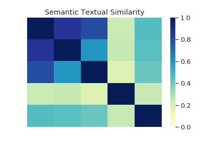

## What is a Universal Encoder?

The Universal Sentence Encoder encodes text into high dimensional vectors that can be used for text classification, semantic similarity, clustering and other natural language tasks.

The model is trained and optimized for greater-than-word length text, such as sentences, phrases or short paragraphs. It is trained on a variety of data sources and a variety of tasks with the aim of dynamically accommodating a wide variety of natural language understanding tasks. The input is variable length English text and the output is a 512 dimensional vector.



## Example use
From the official Website:

```python
embed = hub.Module("https://tfhub.dev/google/universal-sentence-encoder/1")
embeddings = embed([
    "The quick brown fox jumps over the lazy dog.",
    "I am a sentence for which I would like to get its embedding"])

print(session.run(embeddings))

# The following are example embedding output of 512 dimensions per sentence
# Embedding for: The quick brown fox jumps over the lazy dog.
# [-0.016987282782793045, -0.008949815295636654, -0.0070627182722091675, ...]
# Embedding for: I am a sentence for which I would like to get its embedding.
# [0.03531332314014435, -0.025384284555912018, -0.007880025543272495, ...]
```

## Semantic Similarity

Semantic similarity is a measure of the degree to which two pieces of text carry the same meaning. This is broadly useful in obtaining good coverage over the numerous ways that a thought can be expressed using language without needing to manually enumerate them.


## Why convert text into vectors?

A vector is an array of numbers of a particular dimension. A vector of size 5×1 contain 5 numbers and we can think of it as a point in 5D space. If there are two vectors each of dimension 5, they can be thought of two points in a 5D space. Thus we can calculate how close or distant those two vectors are, depending on the distance measure between them.

Hence, lots of efforts in machine learning research are bring put to converting data into a vector as once data is converted into a vector, we can say two data points are similar or not by calculating their distance. Techniques like Word2vec and Glove do that by converting a word to vector. Thus the corresponding vector of “cat” will be closer to “dog” than “eagle”. But while embedding a sentence, along with words the context of the whole sentence needs to be captured in that vector. This is where the “Universal Sentence Encoder” comes into the picture.

## Using in Rest API

While using it in Rest API, you have to call it multiple times. Calling the module and session, again and again, will be very time-consuming. (~16s for each call from our testing). One thing can be done is to call the module and create the session at the start, and continue reusing it. (The first call takes ~16s and then consecutive calls in about 3s).

```python
#Function so that one session can be called multiple times. 
#Useful while multiple calls need to be done for embedding. 
import tensorflow as tf
import tensorflow_hub as hub
def embed_useT(module):
    with tf.Graph().as_default():
        sentences = tf.placeholder(tf.string)
        embed = hub.Module(module)
        embeddings = embed(sentences)
        session = tf.train.MonitoredSession()
    return lambda x: session.run(embeddings, {sentences: x})
embed_fn = embed_useT('../sentence_wise_email/module/module_useT')
messages = [
    "we are sorry for the inconvenience",
    "we are sorry for the delay",
    "we regret for your inconvenience",
    "we don't deliver to baner region in pune",
    "we will get you the best possible rate"
]
embed_fn(messages)

```

The output is a matrix of dimension 5 * 512. (each sentence is a vector of size 512). Since the values are normalized, the inner product of encodings can be treated as a similarity matrix.

We have applied this to Wikipedia texts of 100,000 document. Each xml file contains multiple documents separated by <doc> and </doc>. The output will be 100,000 files with matrix of dimension 5 * 512 for each file.
      

 References  - 

 https://towardsdatascience.com/use-cases-of-googles-universal-sentence-encoder-in-production-dd5aaab4fc15

 https://tfhub.dev/google/universal-sentence-encoder/1

Daniel Cer, Yinfei Yang, Sheng-yi Kong, Nan Hua, Nicole Limtiaco, Rhomni St. John, Noah Constant, Mario Guajardo-Céspedes, Steve Yuan, Chris Tar, Yun-Hsuan Sung, Brian Strope, Ray Kurzweil. Universal Sentence Encoder. arXiv:1803.11175, 2018.
